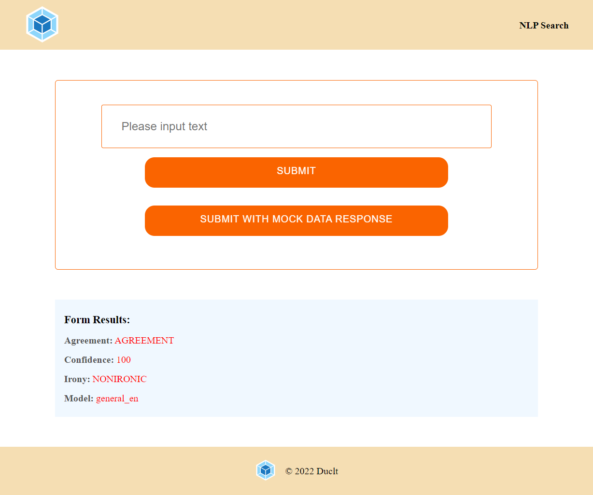
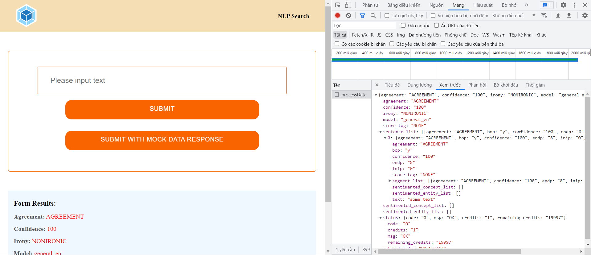

# Project Instructions

This repo is your starter code for the project. It is the same as the starter code we began with in lesson 2. Install and configure Webpack just as we did in the course. Feel free to refer to the course repo as you build this one, and remember to make frequent commits and to create and merge branches as necessary!

The goal of this project is to give you practice with:
- Setting up Webpack
- Sass styles
- Webpack Loaders and Plugins
- Creating layouts and page design
- Service workers
- Using APIs and creating requests to external urls

On top of that, I want to introduce you to the topic of Natural Language Processing. NLPs leverage machine learning and deep learning create a program that can interpret natural human speech. Systems like Alexa, Google Assistant, and many voice interaction programs are well known to us, but understanding human speech is an incredibly difficult task and requires a lot of resources to achieve. Full disclosure, this is the Wikipedia definition, but I found it to be a clear one:

> Natural language processing (NLP) is a subfield of computer science, information engineering, and artificial intelligence
concerned with the interactions between computers and human (natural) languages, in particular how to program computers to
process and analyze large amounts of natural language data.

You could spend years and get a masters degree focusing on the details of creating NLP systems and algorithms. Typically, NLP programs require far more resources than individuals have access to, but a fairly new API called Aylien has put a public facing API in front of their NLP system. We will use it in this project to determine various attributes of an article or blog post.

## Getting started

It would probably be good to first get your basic project setup and functioning. Follow the steps from the course up to Lesson 4 but don't add Service Workers just yet. We won't need the service workers during development and having extra caches floating around just means there's more potential for confusion. So, fork this repo and begin your project setup.

Remember that once you clone, you will still need to install everything:

`cd` into your new folder and run:
- `npm install --legacy-peer-deps`
Note: Using below dependencies and node version 14.21.1

"dependencies": {
"dotenv": "^8.2.0",
"express": "^4.17.1",
"jest-fetch-mock": "^3.0.3",
"webpack": "^4.35.3",
"webpack-cli": "^3.3.5"
},
"devDependencies": {
"@babel/core": "^7.13.15",
"@babel/plugin-transform-modules-commonjs": "^7.13.8",
"@babel/preset-env": "^7.13.15",
"babel-loader": "^8.2.2",
"body-parser": "^1.19.0",
"clean-webpack-plugin": "^3.0.0",
"cors": "^2.8.5",
"css-loader": "^5.2.1",
"html-webpack-plugin": "^3.2.0",
"jest": "^26.6.3",
"mini-css-extract-plugin": "^1.4.1",
"node-fetch": "^2.6.1",
"node-sass": "^5.0.0",
"optimize-css-assets-webpack-plugin": "^5.0.4",
"sass": "^1.32.8",
"sass-loader": "^10.1.1",
"style-loader": "^2.0.0",
"terser-webpack-plugin": "^5.1.1",
"webpack-dev-server": "^3.11.2",
"workbox-webpack-plugin": "^6.1.5"
}
```

## Setting up the API

### Step 1: Signup for an API key
For the MeaningCloud API: You can find the API [here](https://www.meaningcloud.com/developer/sentiment-analysis). Once you create an account with MeaningCloud, you will be given a license key to start using the API.

### Step 2: Environment Variables
Next we need to declare our API keys, which will look something like this:
```
// sample to setup API credentias
const formdata = new FormData();
formdata.append("key", "YOUR API KEY");
formdata.append("txt", "YOUR TEXT HERE");
formdata.append("model", "MODEL HERE");

const requestOptions = {
  method: 'POST',
  body: formdata,
  redirect: 'follow'
};

const response = fetch("https://api.meaningcloud.com/class-2.0", requestOptions)
  .then(response => ({
    status: response.status, 
    body: response.json()
  }))
  .then(({ status, body }) => console.log(status, body))
  .catch(error => console.log('error', error));
```

...but there's a problem with this. We are about to put our personal API keys into a file, but when we push, this file is going to be available PUBLICLY on Github. Private keys, visible publicly are never a good thing. So, we have to figure out a way to make that not happen. The way we will do that is with environment variables. Environment variables are pretty much like normal variables in that they have a name and hold a value, but these variables only belong to your system and won't be visible when you push to a different environment like Github.

- [x] Use npm or yarn to install the dotenv package ```npm install dotenv```. This will allow us to use environment variables we set in a new file
- [x] Create a new ```.env``` file in the root of your project
- [x] Go to your .gitignore file and add ```.env``` - this will make sure that we don't push our environment variables to Github! If you forget this step, all of the work we did to protect our API keys was pointless.
- [x] Fill the .env file with your API keys like this:
```
API_ID=**************************
API_KEY=**************************
```
- [x] Add this code to the very top of your server/index.js file:
```
const dotenv = require('dotenv');
dotenv.config();
```
- [x] Reference variables you created in the .env file by putting ```process.env``` in front of it, an example might look like this:
```
console.log(`Your API key is ${process.env.API_KEY}`);
```
...Not that you would want to do that. This means that our updated API credential settings will look like this:
```javascript
// set aylien API credentials
// NOTICE that textapi is the name I used, but it is arbitrary. 
// You could call it aylienapi, nlp, or anything else, 
//   just make sure to make that change universally!
var textapi = new aylien({
  application_id: process.env.API_ID,
  application_key: process.env.API_KEY
});
```

### Step 3: Using the API

We're ready to go! The API has a lot of different endpoints you can take a look at [here](https://learn.meaningcloud.com/developer/text-classification/2.0).

## Deploying

A great step to take with your finished project would be to deploy it! Unfortunately its a bit out of scope for me to explain too much about how to do that here, but checkout [Netlify](https://www.netlify.com/) or [Heroku](https://www.heroku.com/) for some really intuitive free hosting options.

## Screenshot
### Overview




### Request and response

